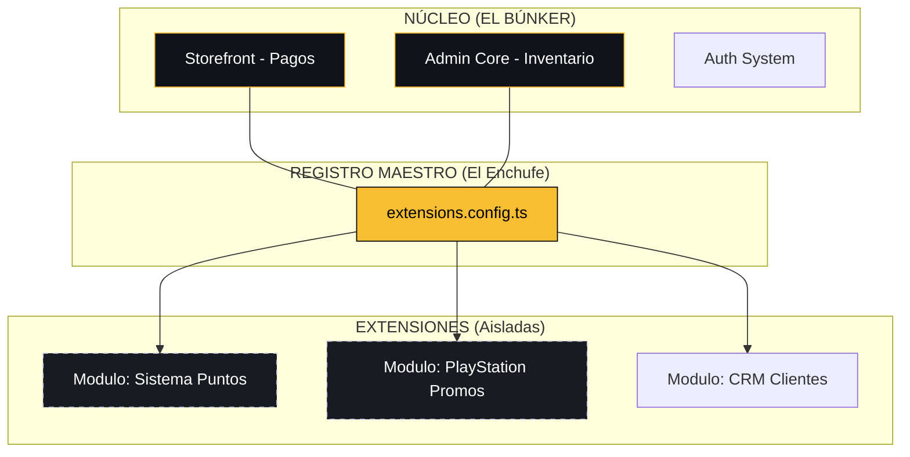

# 🧩 ARQUITECTURA DE MÓDULOS ENCHUFABLES (DACRIBEL EXTENSIONS)

> [!IMPORTANT]
> **REGLA DE ORO**: NUNCA CREAR COPIAS DE SEGURIDAD EN GITHUB DE FORMA AUTOMÁTICA. LAS COPIAS DE SEGURIDAD LAS ACTUALIZA ÚNICAMENTE **CRISTIAN (CEO DEL PROYECTO)**.

Este documento define la estrategia para escalar la plataforma Dacribel mediante un sistema de extensiones desacopladas. El objetivo es permitir la adición de nuevas funcionalidades sin comprometer la estabilidad, seguridad o rendimiento del núcleo (Core) ya establecido.

---

## 🎖️ EVALUACIÓN DE LA PROPUESTA
- **Puntaje de Fiabilidad:** 9.5 / 10
- **Puntaje de Estabilidad:** 9.0 / 10
- **Concepto Maestro:** Encapsulamiento Estricto (Sandbox).

---

## 🏛️ FILOSOFÍA DE CONSTRUCCIÓN: EL CENTRO COMERCIAL

Para mantener la coherencia a largo plazo, Dacribel se construye bajo la analogía de un **Centro Comercial de Alta Gama**:

1.  **La Nave Nodriza (El Centro Comercial / Puerto 3003)**:
    - Es la infraestructura principal. Provee seguridad (Auth), energía (Base de Datos) y servicios básicos (Pagos). No necesitamos construir un edificio nuevo para cada idea.
2.  **Los Locales (Los Módulos / Carpeta `/extensions`)**:
    - Son espacios especializados. Cada local tiene su propia decoración y productos (`psn`, `xbox`, etc.), pero todos usan la misma zona de cajas (Checkout maestro) y la misma entrada principal.
3.  **Aislamiento Lógico (Subdominios de Ruta)**:
    - No usamos subdominios reales de servidor (como `psn.dacribel.shop`) para evitar duplicar costos y complejidad. Usamos **Subdominios Lógicos** (`/extensions/psn`). Es la forma más eficiente: misma casa, diferentes habitaciones.

---

## 🏛️ ESTRUCTURA VISUAL (EL ESQUEMA)



---

## 🔌 CONEXIÓN UI/UX: ¿CÓMO SE "ENCHUFA" UN MÓDULO?
*(Caso de estudio: Catálogo de Promociones PlayStation)*

1.  **Registro Automático**: Al añadir el módulo al `registry.ts`, el Sidebar y el Navbar detectan la nueva funcionalidad y renderizan los puntos de acceso (iconos/links) dinámicamente. **Cero cambios en el código de navegación base.**
2.  **Dashboard Independiente**: El catálogo vive en su propia ruta aislada (`app/(extensions)/psn-promos`). Utiliza los cimientos estéticos (Vault Design) pero su lógica interna es autónoma.
3.  **Integración no Intrusiva**: Se pueden inyectar "Widgets" en la Home principal que solo se muestran si el módulo está activo. Estos actúan como puentes hacia la extensión.
4.  **Reuso de Funciones Core**: Si el usuario decide comprar desde una extensión, se dispara el flujo de pago estándar (`ProductBottomSheet`), aprovechando el búnker de pagos ya probado.

---

## 🛡️ PROTOCOLO DE FALLO: AISLAMIENTO POR SUBDOMINIO LÓGICO
Dacribel implementa un sistema de **aislamiento de alta disponibilidad**. Aunque todas las extensiones residen en el mismo repositorio, se comportan arquitectónicamente como **subdominios independientes**.

1.  **Contención Granular (Error Boundaries)**: Se ha desplegado un escudo térmico (`error.tsx`) en el directorio `/extensions`. Si un módulo sufre un fallo crítico, el error es contenido en ese "subdominio lógico". El dominio principal (`/`) y el panel administrativo (`/admin`) permanecen 100% operativos.
2.  **Desconexión Instantánea (Kill Switch)**: El registro maestro permite revocar el acceso a cualquier extensión en tiempo real. Al desactivar un módulo, este "desaparece" de la interfaz de usuario sin dejar rastro en el bundle de producción.
3.  **Independencia de Recursos**: El estado de renderizado y las dependencias de las extensiones están encapsuladas, garantizando que el rendimiento de la pasarela de pagos principal nunca se vea comprometido por procesos experimentales.
4.  **Integridad de Datos Multicapa**: Mediante esquemas de base de datos separados, se asegura que una brecha o corrupción en un módulo adicional no tenga visibilidad ni permisos sobre el inventario y las órdenes del core.

---

## 📊 ANÁLISIS DE LA SOLUCIÓN

### PROS (Ventajas) ✅
- **Libertad Total de Experimentación**: Puedes "jugar" con nuevas ideas en `(extensions)` sin miedo a un colapso total.
- **Seguridad Financiera**: El flujo de dinero (Pagos) queda encapsulado y lejos del código experimental.
- **Bundle Optimizado**: Solo se carga lo que se usa.

### CONTRAS (Riesgos a Vigilar) ⚠️
- Requiere disciplina para no duplicar lógica que ya existe en el Core.

---

## 🚀 IMPLEMENTACIÓN ACTUAL (FASE 1: INFRAESTRUCTURA)
*Estado: OPERATIVO / LISTO PARA ENCHUFAR* ✅

Se ha desplegado el esqueleto maestro del Sandbox para garantizar el aislamiento total desde hoy:

1.  **[extensions.ts](file:///c:/Users/cange/Documents/Psn/config/extensions.ts)**: Registro central y "Kill Switch" de módulos.
2.  **[layout.tsx](file:///c:/Users/cange/Documents/Psn/app/(extensions)/layout.tsx)**: Contenedor estético aislado (Búnker de renderizado).
3.  **[error.tsx](file:///c:/Users/cange/Documents/Psn/app/(extensions)/error.tsx)**: Escudo térmico que captura crasheos y protege el Core.
4.  **[page.tsx](file:///c:/Users/cange/Documents/Psn/app/(extensions)/page.tsx)**: Dashboard dinámico de módulos activos.

---

## 📁 MAPA DE CARPETAS ESTRUCTURADO

```text
c:\Users\cange\Documents\Psn\
├── app/
│   ├── (store)/          <-- CLIENTE FINAL (Intocable)
│   ├── (admin)/          <-- PANEL GESTIÓN (Intocable)
│   └── extensions/       <-- LA ARENA DE PRUEBAS / SANDBOX (Implementado)
│       ├── layout.tsx    <-- El Escudo Térmico (Error Boundaries)
│       ├── error.tsx     <-- Failsafe activo
│       ├── page.tsx      <-- Dashboard de control
│       └── [ext_id]/     <-- Espacio para nuevos módulos
├── config/
│   └── extensions.ts     <-- EL INTERRUPTOR MAESTRO (Implementado)
└── Markdown/
    └── database.md       <-- DOCUMENTACIÓN MAESTRA DE SQL (Dashboard Web)
```

---

## ⚠️ LECCIONES APRENDIDAS Y PROTOCOLO DE ERRORES

### 1. El "Punto Crítico" (config/extensions.ts)
- **Problema detectado**: Al ser el único archivo compartido por todos los módulos, cualquier error de sintaxis (una coma faltante, un comentario mal cerrado) provoca un "Build Error" total que pone la web en rojo.
- **Protocolo de Prevención**: 
    - **NUNCA** hacer ediciones parciales (parches) si la estructura del array es compleja.
    - **SIEMPRE** preferir el reemplazo total del contenido del archivo para asegurar la integridad de los brackets `[]` y llaves `{}`.
    - Se recomienda verificar la salud del "Enchufe Central" inmediatamente después de registrar un módulo nuevo.

### 2. Aislamiento de Layouts
- Los errores dentro de la carpeta `app/extensions/NOMBRE_MODULO` son capturados por el `error.tsx` local, pero los errores en la *configuración* (fuera del módulo) no. Es vital diferenciar entre un fallo del "Local" y un fallo del "Tablero Eléctrico".

---
*Dacribel: Bóveda Digital Inexpugnable & Escalable.*
*Última Actualización: 13/04/2026 por Antigravity AI.*
